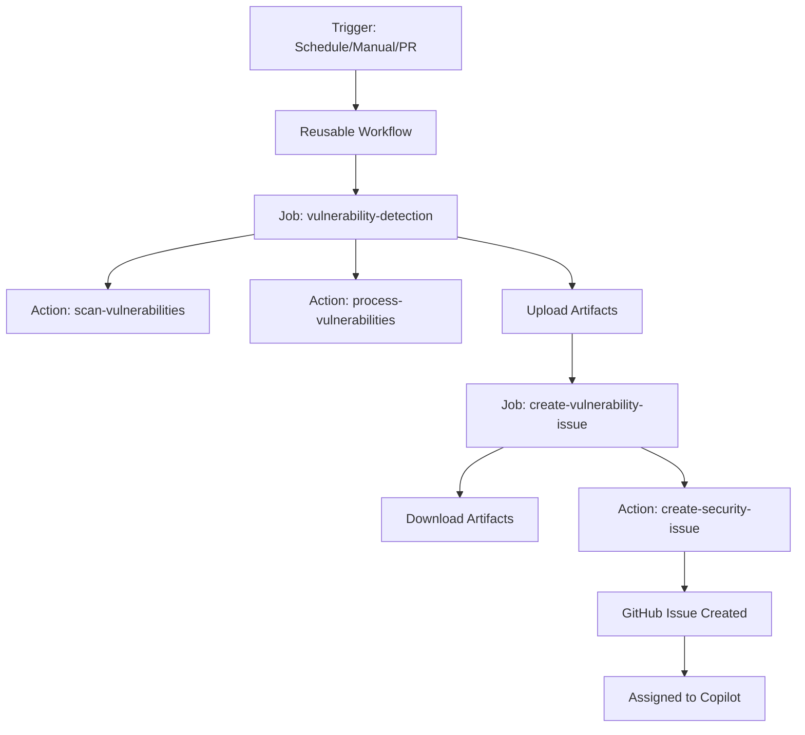

# Production-Ready Modular Security Scanning System

This directory contains a complete, production-ready security vulnerability scanning system built with a modular architecture for maximum reusability and maintainability.

## 🎯 Quick Start

### Option 1: Use the Reusable Workflow (Recommended)

In your repository, create `.github/workflows/security-scan.yml`:

```yaml
name: Security Scan

on:
  schedule:
    - cron: '0 2 * * *'
  workflow_dispatch:

jobs:
  security-scan:
    uses: denukedissanayake/security-workflows/.github/workflows/security-scan-reusable.yml@main
    with:
      language: 'auto'  # Auto-detect or specify: nodejs, python, rust, scala, java, go, etc.
      scanner: 'auto'   # Auto-select or specify: snyk, npm-audit, pip-audit, etc.
      create-issue: true
      severity-threshold: 'low'
    secrets:
      SNYK_TOKEN: ${{ secrets.SNYK_TOKEN }}
      GH_TOKEN: ${{ secrets.GH_TOKEN }}
```

### Option 2: Use in This Repository

The workflow is already configured and runs automatically:
- ⏰ Daily at 2 AM UTC
- 🔀 On pushes/PRs to main
- 🖱️ Manually via workflow_dispatch

## 📁 Project Structure

```
.github/
├── workflows/
│   ├── security-scan-reusable.yml    # 🔄 Reusable workflow (orchestrator)
│   └── security-scan-caller.yml      # 📞 Example caller workflow
│
└── actions/                           # 🧩 Modular composite actions
    ├── scan-vulnerabilities/          # 1️⃣ Scanning logic
    │   └── action.yml
    ├── process-vulnerabilities/       # 2️⃣ Processing logic
    │   └── action.yml
    └── create-security-issue/         # 3️⃣ Issue creation logic
        └── action.yml

Documentation/
├── WORKFLOW_DOCUMENTATION.md          # 📖 Complete guide
├── COMPOSITE_ACTIONS_REFERENCE.md     # 🔍 Quick reference
└── MIGRATION_GUIDE.md                 # 🔄 Migration from old workflow
```

## 🎨 Architecture Overview



## ✨ Key Features

### 🔄 Reusable Across Repositories
- Import as a reusable workflow
- Share with your entire organization
- Consistent security scanning everywhere

### 🧩 Modular Components
- **scan-vulnerabilities**: Runs Snyk scans
- **process-vulnerabilities**: Analyzes results
- **create-security-issue**: Creates GitHub issues

### 🤖 AI-Powered
- Automatic assignment to GitHub Copilot
- AI-suggested fixes
- Smart severity classification

### 📊 Rich Reporting
- GitHub Actions summaries
- Detailed vulnerability reports
- CVE tracking and CVSS scores

### ⚙️ Highly Configurable
- Customize Node.js version
- Set working directory
- Enable/disable issue creation
- And more!

## 📚 Documentation

| Document | Description | Audience |
|----------|-------------|----------|
| [WORKFLOW_DOCUMENTATION.md](WORKFLOW_DOCUMENTATION.md) | Complete guide with examples | Everyone |
| [COMPOSITE_ACTIONS_REFERENCE.md](COMPOSITE_ACTIONS_REFERENCE.md) | Action inputs/outputs reference | Developers |
| [MIGRATION_GUIDE.md](MIGRATION_GUIDE.md) | How to migrate from old workflow | Existing users |

## 🔧 Prerequisites

1. **Snyk Account**
   - Sign up at [snyk.io](https://snyk.io)
   - Get your API token
   - Add as `SNYK_TOKEN` repository secret

2. **GitHub Token**
   - Create a Personal Access Token
   - Needs `repo` scope
   - Add as `GH_TOKEN` repository secret

3. **Repository Permissions**
   ```yaml
   permissions:
     contents: read
     issues: write
     pull-requests: write
     security-events: write
   ```

## 🚀 Usage Examples

### Basic Usage

**From this repository (testing):**
```yaml
jobs:
  scan:
    uses: ./.github/workflows/security-scan-reusable.yml
    secrets:
      SNYK_TOKEN: ${{ secrets.SNYK_TOKEN }}
      GH_TOKEN: ${{ secrets.GH_TOKEN }}
```

**From other repositories (production):**
```yaml
jobs:
  scan:
    uses: denukedissanayake/security-workflows/.github/workflows/security-scan-reusable.yml@main
    secrets:
      SNYK_TOKEN: ${{ secrets.SNYK_TOKEN }}
      GH_TOKEN: ${{ secrets.GH_TOKEN }}
```

### Advanced Usage

**From this repository:**
```yaml
jobs:
  scan-frontend:
    uses: ./.github/workflows/security-scan-reusable.yml
    with:
      language: 'nodejs'
      working-directory: './frontend'
      create-issue: true
    secrets:
      SNYK_TOKEN: ${{ secrets.SNYK_TOKEN }}
      GH_TOKEN: ${{ secrets.GH_TOKEN }}
  
  scan-backend:
    uses: ./.github/workflows/security-scan-reusable.yml
    with:
      language: 'python'
      working-directory: './backend'
    secrets:
      SNYK_TOKEN: ${{ secrets.SNYK_TOKEN }}
      GH_TOKEN: ${{ secrets.GH_TOKEN }}
```

**From other repositories:**
```yaml
jobs:
  scan-frontend:
    uses: denukedissanayake/security-workflows/.github/workflows/security-scan-reusable.yml@main
    with:
      language: 'nodejs'
      working-directory: './frontend'
      create-issue: true
    secrets:
      SNYK_TOKEN: ${{ secrets.SNYK_TOKEN }}
      GH_TOKEN: ${{ secrets.GH_TOKEN }}
  
  scan-backend:
    uses: denukedissanayake/security-workflows/.github/workflows/security-scan-reusable.yml@main
    with:
      language: 'python'
      working-directory: './backend'
    secrets:
      SNYK_TOKEN: ${{ secrets.SNYK_TOKEN }}
      GH_TOKEN: ${{ secrets.GH_TOKEN }}
```

### Custom Workflow with Individual Actions

**From this repository:**
```yaml
jobs:
  custom-scan:
    runs-on: ubuntu-latest
    steps:
      - uses: actions/checkout@v4
      
      - id: scan
        uses: ./.github/actions/scan-vulnerabilities
        with:
          snyk-token: ${{ secrets.SNYK_TOKEN }}
      
      - id: process
        uses: ./.github/actions/process-vulnerabilities
        with:
          scan-results-path: ${{ steps.scan.outputs.scan-results-path }}
          repository: ${{ github.repository }}
      
      # Custom logic here
      - name: Send to Slack
        if: steps.process.outputs.has-vulnerabilities == 'true'
        run: |
          echo "Found ${{ steps.process.outputs.vulnerability-count }} issues!"
```

**From other repositories:**
```yaml
jobs:
  custom-scan:
    runs-on: ubuntu-latest
    steps:
      - uses: actions/checkout@v4
      
      - id: scan
        uses: denukedissanayake/security-workflows/.github/actions/scan-vulnerabilities@main
        with:
          snyk-token: ${{ secrets.SNYK_TOKEN }}
      
      - id: process
        uses: denukedissanayake/security-workflows/.github/actions/process-vulnerabilities@main
        with:
          scan-results-path: ${{ steps.scan.outputs.scan-results-path }}
          repository: ${{ github.repository }}
      
      # Custom logic here
      - name: Send to Slack
        if: steps.process.outputs.has-vulnerabilities == 'true'
        run: |
          echo "Found ${{ steps.process.outputs.vulnerability-count }} issues!"
```

## 🎯 What Gets Created

When vulnerabilities are found:

1. **📊 GitHub Actions Summary**
   - Vulnerability counts by severity
   - Scan date and statistics

2. **📄 Artifacts**
   - `full-scan-results.json`: Complete Snyk results
   - `detailed-vulnerabilities.json`: Processed data
   - `vulnerability-context.md`: Human-readable report

3. **🎫 GitHub Issue**
   - Comprehensive vulnerability details
   - Fix commands for each issue
   - Copilot assistance request
   - Automatic labels and assignment

## 🔒 Security Best Practices

- ✅ Store tokens as secrets (never hardcode)
- ✅ Use least-privilege permissions
- ✅ Run scans regularly (daily recommended)
- ✅ Review and fix vulnerabilities promptly
- ✅ Keep dependencies updated
- ✅ Enable Dependabot alerts

## 📊 Comparison: Before vs After

| Aspect | Monolithic Workflow | Modular Architecture |
|--------|---------------------|----------------------|
| **File Size** | 500+ lines | 60 lines (workflow) + 3 focused actions |
| **Reusability** | Copy-paste entire file | Import as workflow/actions |
| **Maintainability** | Difficult | Easy - edit one component |
| **Testing** | Test entire workflow | Test individual components |
| **Customization** | Edit massive file | Configure inputs |
| **Documentation** | One README | Component-specific docs |
| **Debugging** | Debug 500 lines | Debug focused components |

## 🛠️ Customization

### Change Scan Schedule

```yaml
on:
  schedule:
    - cron: '0 */6 * * *'  # Every 6 hours instead of daily
```

### Scan Multiple Directories

```yaml
jobs:
  frontend:
    uses: ./.github/workflows/security-scan-reusable.yml
    with:
      working-directory: './frontend'
    secrets:
      SNYK_TOKEN: ${{ secrets.SNYK_TOKEN }}
  
  backend:
    uses: ./.github/workflows/security-scan-reusable.yml
    with:
      working-directory: './backend'
    secrets:
      SNYK_TOKEN: ${{ secrets.SNYK_TOKEN }}
```

### Disable Issue Creation

```yaml
jobs:
  scan:
    uses: ./.github/workflows/security-scan-reusable.yml
    with:
      create-issue: false  # Just scan, don't create issues
    secrets:
      SNYK_TOKEN: ${{ secrets.SNYK_TOKEN }}
```

## 🐛 Troubleshooting

### Common Issues

1. **"SNYK_TOKEN not found"**
   - Add secret in Settings → Secrets → Actions

2. **"Cannot create issue"**
   - Ensure GH_TOKEN has `repo` scope
   - Or use GITHUB_TOKEN (limited functionality)

3. **"Action not found"**
   - Ensure `actions/checkout@v4` runs first
   - Check action path is correct

See [WORKFLOW_DOCUMENTATION.md](WORKFLOW_DOCUMENTATION.md#troubleshooting) for more.

## 📈 Metrics & Monitoring

Track your security posture:

```yaml
- name: Export metrics
  if: always()
  run: |
    echo "vulnerabilities_found=${{ needs.scan.outputs.vulnerabilities-found }}" >> metrics.txt
    # Send to monitoring system
```

## 🤝 Contributing

Improvements welcome! To contribute:

1. Fork the repository
2. Create a feature branch
3. Make your changes
4. Test thoroughly
5. Submit a pull request

## 📄 License

See [LICENSE](../LICENSE) for details.

## 🙏 Acknowledgments

- **Snyk** - Vulnerability scanning
- **GitHub Actions** - Automation platform
- **GitHub Copilot** - AI-powered fixes

## 📞 Support

- 📖 **Documentation**: See docs above
- 🐛 **Issues**: [GitHub Issues](https://github.com/your-org/ai-bug-fix/issues)
- 💬 **Discussions**: [GitHub Discussions](https://github.com/your-org/ai-bug-fix/discussions)

## 🎓 Learn More

- [GitHub Actions Documentation](https://docs.github.com/en/actions)
- [Composite Actions Guide](https://docs.github.com/en/actions/creating-actions/creating-a-composite-action)
- [Reusable Workflows](https://docs.github.com/en/actions/using-workflows/reusing-workflows)
- [Snyk Documentation](https://docs.snyk.io)

---

**Made with ❤️ for secure software development**

*Star ⭐ this repo if you find it useful!*
